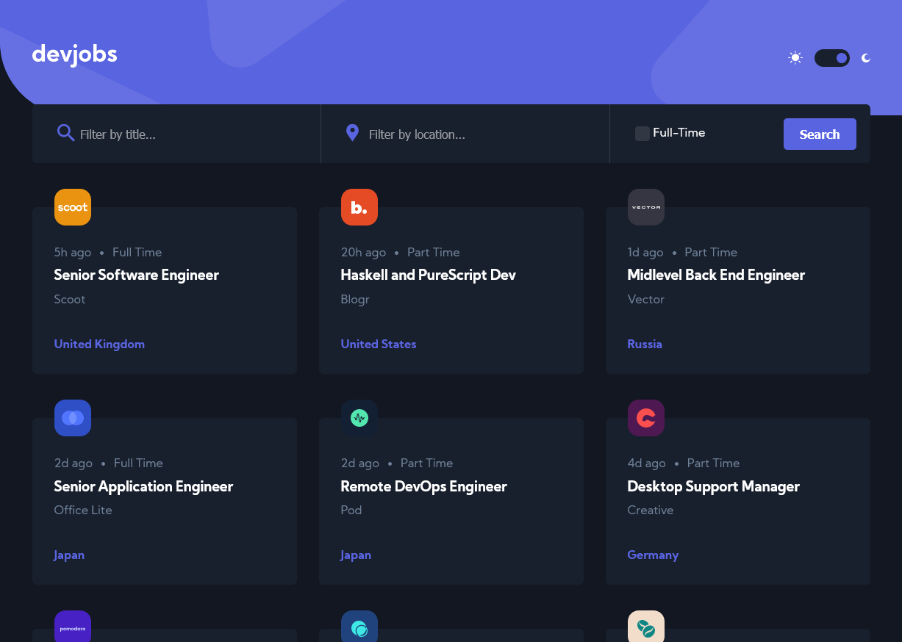

# Frontend Mentor - GitHub Jobs API solution

This is a solution to the [GitHub Jobs API challenge on Frontend Mentor](https://www.frontendmentor.io/challenges/github-jobs-api-93L-NL6rP). Frontend Mentor challenges help you improve your coding skills by building realistic projects.

## Table of contents

- [Overview](#overview)
  - [The challenge](#the-challenge)
  - [Screenshot](#screenshot)
  - [Links](#links)
- [My process](#my-process)
  - [Built with](#built-with)
  - [What I learned](#what-i-learned)
  - [Continued development](#continued-development)
- [Author](#author)

## Overview

### The challenge

Users should be able to:

- View the optimal layout for each page depending on their device's screen size
- See hover states for all interactive elements throughout the site
- View all jobs currently live on the GitHub Jobs API
- Be able to click a job from the index page so that they can read more information and apply for the job

### Screenshot



### Links

- Solution URL: [https://github.com/Joelynn94/devjobs-web-app](https://github.com/Joelynn94/devjobs-web-app)
- Live Site URL: [https://jl-dev-jobs.netlify.app/](https://jl-dev-jobs.netlify.app/)

## My process

### Built with

- Semantic HTML5 markup
- CSS custom properties
- Flexbox
- CSS Grid
- Mobile-first workflow
- LocalStorage
- [React](https://reactjs.org/) - JS library

### What I learned

I was struggling with filtering the jobs correctly. At first I was only able to filter based on the job title, or location, or full time but not all criteria at once. I kept working through the issue and finally found a solution. I had to add the filtering in the onSubmit and filter based on all inputs at once. I also used react lazy state to control the light/dark theme toggle. I provided code snippets for both of these, below.

```js
const filteredItems = jobs.filter(
  (job) =>
    job.position.toLowerCase().includes(searchTerm.toLowerCase()) &&
    job.location.toLowerCase().includes(searchLocation.toLowerCase()) &&
    job.contract === "Full Time"
);
```

```js
const [darkTheme, setDarkTheme] = useState(
  () => localStorage.getItem("dark_theme") === "false"
);
```

### Continued development

I will continue working on searching/filtering arrays and strings by solving alrgothim problems on CodeWars. I also want to refine my application architecture. I am always looking for ways to cleanup my code.

## Author

- Website - [Joseph Lynn](https://www.josephlynn.com/)
- Frontend Mentor - [@Joelynn94](https://www.frontendmentor.io/profile/Joelynn94)
- Twitter - [@joe1ynn](https://twitter.com/joe1ynn)
